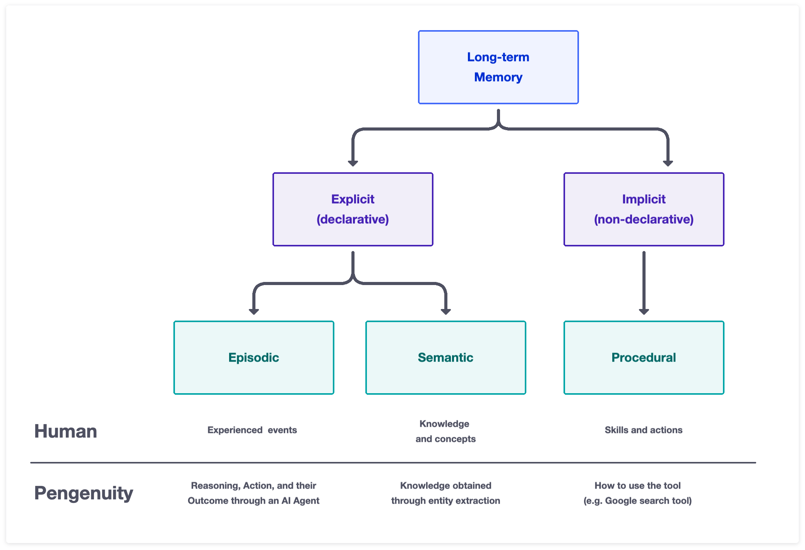
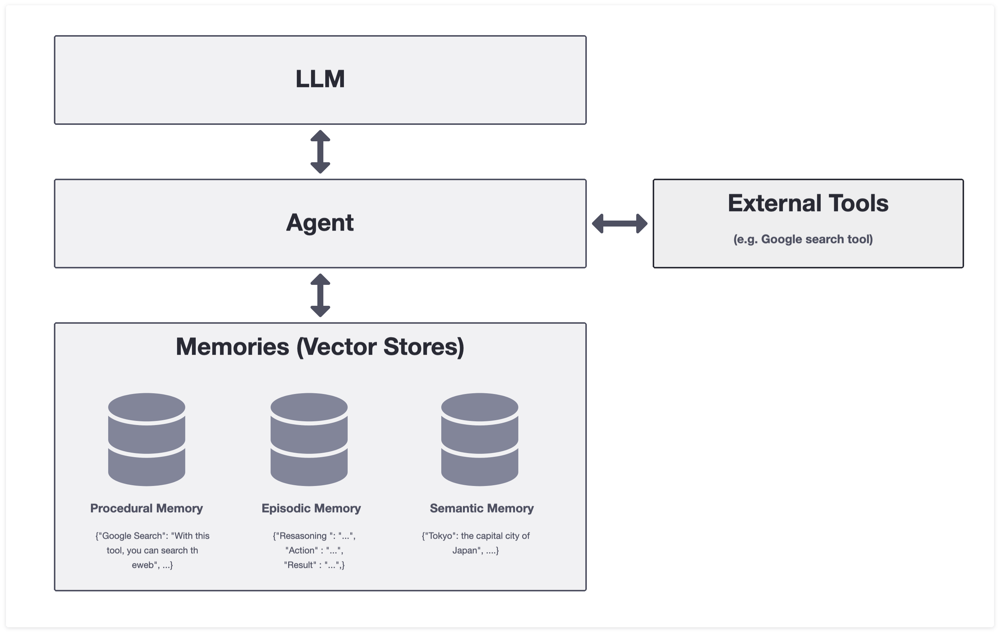
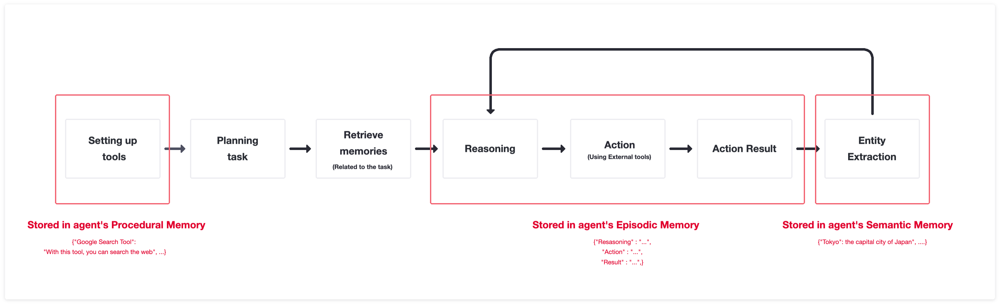

# Pengenuity: ReAct Agent with Human Like Memory System


Pengenuity is an experimental open-source autonomous AI Agent that aims to replicate the structure of human memory. The project's ultimate goal is to create an AI agent that can learn and reason like a human, with the hope of better understanding the nature of human cognition.


## ✔️ Features

Pengunuity is designed to have the following features:

- A memory structure that mimics human long-term memory:
  - Procedural memory for the storage and retrieval of tool usage procedures.
  - Semantic memory for the storage and retrieval of concepts and knowledge.
  - Episodic memory for the storage and retrieval of specific events or episodes.
- The ability to learn new concepts and remember task execution results while performing tasks.
- Proficient use of tools based on its Procedural memory:
  - The built-in tools include only the default Google search tool for web browsing.
  - Customization of tools, allowing users to add and tailor tools to their specific needs and preferences.
- Designed to operate using GPT-3.5.
- Developed based on LangChain, making it compatible with the LangChain ecosystem.

## 🎬 Demo


## 🧠 Human Like Memory System



Human long-term memory consists of three types: Procedural memory, Semantic memory, and Episodic memory.

- Procedural memory stores and retrieves procedural knowledge, such as how to perform specific tasks or use external tools specified by the user.
- Semantic memory stores and retrieves concepts and knowledge, such as general facts and concepts, word meanings, and common knowledge that people have.
- Episodic memory stores and retrieves personal experiences and events.



Pengenuity's memory structure is based on human long-term memory and consists of three vector stores:

 - Procedural memory vector store: stores and retrieves tool usage procedures. It saves information about external tools specified by the user.

 - Semantic memory vector store: stores and retrieves concepts and knowledge. It saves the knowledge obtained through entity extraction.

 - Episodic memory vector store: stores and retrieves specific events or episodes. It saves the sequence of agent's actions.


## 🚗 How It Works



This script operates in the following loop:

1. The agent generates a task list based on the goal provided by the user.
2. The agent searches for memories related to the most recently tackled task, looking for relevant concepts and past reasoning and action results.
3. Based on the search results, it determines the next action to take.
4. It executes the action using external tools.
5. It performs entity extraction on the execution results, learning new concepts and storing reasoning and actions and their results as an episode in memory.
6.It returns to step 2.


## 🔧 Installation

To install Pengenuity, follow these steps:

1. Clone the repository:

```bash
git clone https://github.com/dory111111/Pengenuity.git
```

2. Navigate to the directory where the repository was downloaded

```bash
cd Pengenuity
```

3. Install the required dependencies poetryを使って

```bash
poetry install
```

4. Rename `.env.sample` to `.env` 

5. Open the `.env`  file and fill in the following variables:
   - `OPENAI_API_KEY` : Your OpenAI API key.
   - `GOOGLE_API_KEY` : Your Google API key.
   - `GOOGLE_CSE_ID` : Your Google Custom Search Engine ID..

## 💻 Usage

1. Run `Pengenuity` Python module in your terminal

```
poetry run python src/run.py
```

## 🚀 Planned Features
- Lanchain's Tools and ChatGPT plugin as part of Pengenuity's Tool.
- Local LLM support
- Code Refactoring
- Vector Store compatibility
- Alternative User Interface


## 🤖 Supported Models<a name="supported-models"></a>

Default model is **gpt-3.5-turbo**. 
To use a different model, specify it through OPENAI_API_MODEL or use the command line.
GPT-4 and LLaMA compatibility testing is currently not being conducted.

##  Acknowledgments

I would like to express my gratitude to the developers whose code I referenced in creating this repo.

Special thanks go to 

BabyAGI @yoheinakajima (https://github.com/yoheinakajima/babyagi)

Auto-GPT @Significant-Gravitas (https://github.com/Significant-Gravitas/Auto-GPT)